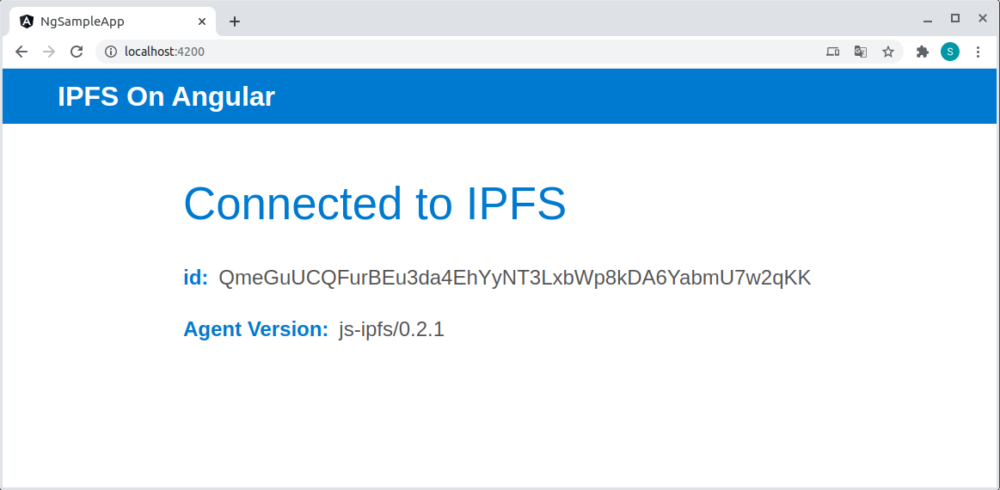

# AngularIpfsSampleApp

A minimal demonstration of how to use js-ipfs with Angular.

This project was generated with [Angular CLI](https://github.com/angular/angular-cli) version 10.2.0.



## Before you start

First clone this repo, install dependencies in the project root and build the project.

```bash
$ git clone git@github.com:ocknamo/angular-ipfs-sample-app.git
$ cd angular-ipfs-sample-app
$ yarn
```

## Development server

Run `yarn start` for a dev server. Navigate to `http://localhost:4200/`. The app will automatically reload if you change any of the source files.

## Build

Run `yarn build` to build the project. The build artifacts will be stored in the `dist/` directory. Use the `--prod` flag for a production build.

## Running unit tests

Run `yarn test` to execute the unit tests via [Karma](https://karma-runner.github.io).

## Running end-to-end tests

Run `yarn e2e` to execute the end-to-end tests via [Protractor](http://www.protractortest.org/).
